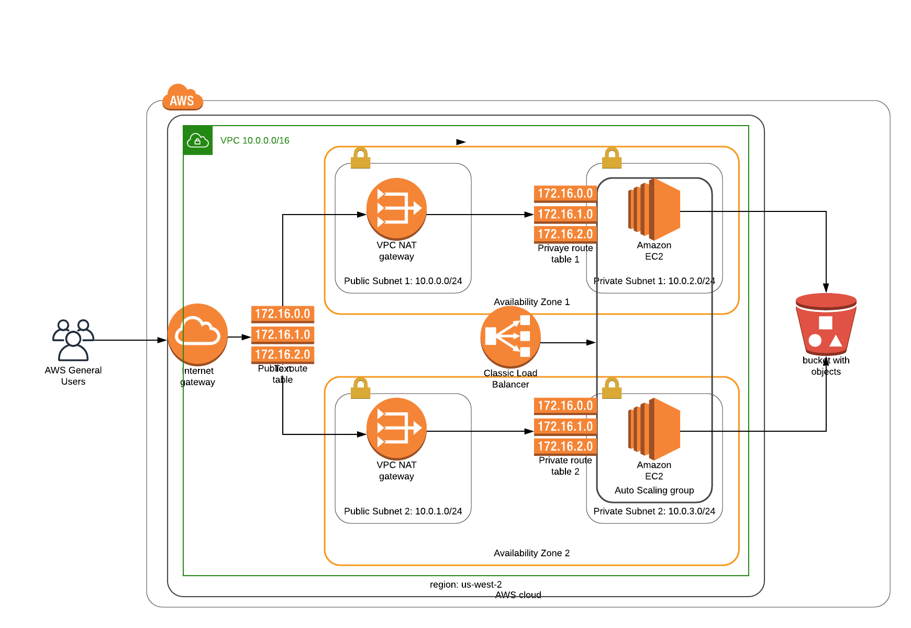

# Deploy a high-availabilty web app using cloudformation



## Create Stack
```./create.sh udagram udagram.yml udagram.json```

## Update Stack
```./update.sh udagram udagram.yml udagram.json```

## Delete Stack
```./delete.sh udagram```

## Output URL
[URL](http://udagr-WebAp-1QVR4FE3P5SCX-210498038.us-west-2.elb.amazonaws.com)
